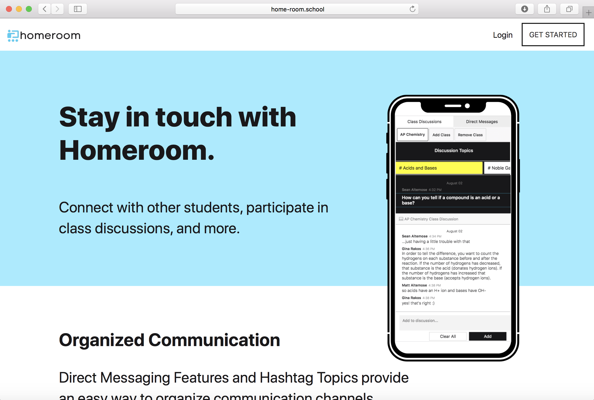
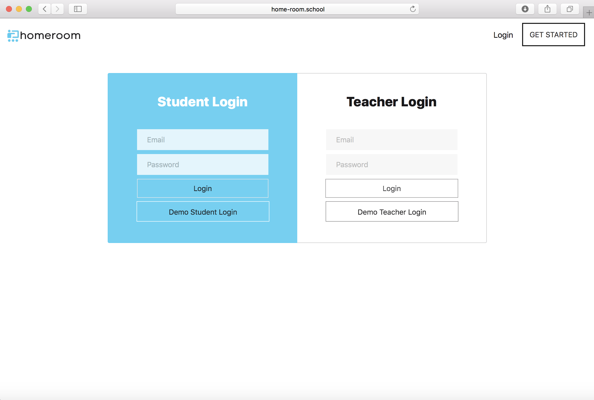
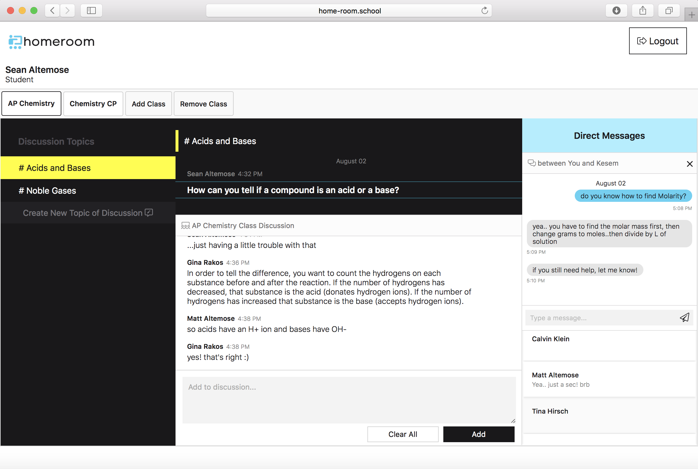

# Homeroom
#### A Communication Platfrom for Work-from-Home Classrooms

[www.home-room.school](http://www.home-room.school)





**About**

- A **MERN Stack** web application with **User Authentication** that serves as a communication platform for work-from-home classrooms.
- **Flexible backend** using **MongoDB** and **Mongoose** that allows for updates and changes to schema as needed when the app user-base grows
- **Express** Routing & **AJAX requests** fetch and post messages to and from the backend to keep track of students and teachers, their classes, and provides an environment for them interact with each other through **direct messages** and **full-classroom chats**.


**Technologies Used**
- MongoDB & Mongoose for object modeling 
- Express
- React
- Node
- Ajax
- HTML5
- CSS
- Heroku, Git

### Coding Highlights

**Class Models** store users (teachers and students) and class discussions topics.

Depending on which class is selected, the proper class discussion topics are displayed.  Within each topic is a series of messages.  These messags are stored with foreign keys that connect them to their topics, and are sorted by time.  When a topic is selected, messages are retreived using an API and displayed in order. Users can add messages and participate in the conversation.

**Direct Messages** are stored with two particpant keys and values, first sorted by ID and saved as ParticipantA and ParticipantB to make all requests consistent. They are retreived from a 'GET' request that uses the current user as well as the other selected direct message participant (student or teacher), and displayed in order of the time created.

```javascript
router.get('/', (req, res) => {
    var query = req.query;
      DirectMessage.find(query)
          .then(directmessages => res.json(directmessages))
          .catch(err => res.status(404).json({ nomessagesfound: 'No messages found' }));
  });
```

```javascript
import axios from 'axios';


export const getDirectMessages = (participantAID, participantBID) => {
  return axios.get(`/api/directmessages?participantA=${participantAID}&participantB=${participantBID}`)
};


```

**TO GET APPLICATION RUNNING ON YOUR LOCAL HOST:**

After cloning, 
run npm install on both the backend and frontend 

In terminal:
run npm run dev (and open localhost:3000)

**To Be Completed**

Add Assignment feature for teachers to create assignments, and for students to view and submit them